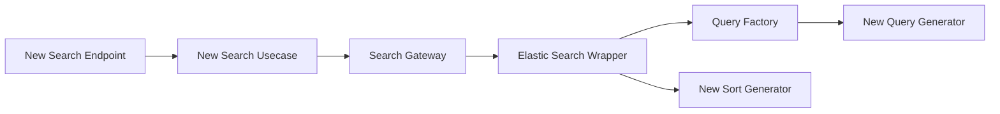

# Housing Search Api

The Housing Search Api is the LBH Api responsible for searching for persons, tenures and assets.

### Api definition

Swagger Hub - https://app.swaggerhub.com/apis/Hackney/housingSearchApi/1.0.0

## Stack

- .NET Core v.3.1 as a web framework.
- xUnit as a test framework.
- ElasticSearch as a datastore.

## Contacts

### Active Maintainers

- **Selwyn Preston**, Lead Developer at London Borough of Hackney (selwyn.preston@hackney.gov.uk)
- **Mirela Georgieva**, Lead Developer at London Borough of Hackney (mirela.georgieva@hackney.gov.uk)
- **Matt Keyworth**, Lead Developer at London Borough of Hackney (matthew.keyworth@hackney.gov.uk)

### Other Contacts

- **Rashmi Shetty**, Product Owner at London Borough of Hackney (rashmi.shetty@hackney.gov.uk)

[docker-download]: https://www.docker.com/products/docker-desktop

## Testing
- Unit Tests
- BDDFy for E2E tests

## Implementing a new search endpoint

### Create the controller endpoint.

You will need to create a new controller and expose a new search endpoint. Refer to any of the existing ones, as well as to the Swagger Hub ( https://app.swaggerhub.com/apis/Hackney/housingSearchApi/1.0.0 ) regarding the request and response format. Most of our searches use the same HousingSearchQuery for a request. The response will vary based on the information you are requesting.

### Create a new usecase
Each new search requires a new search usecase. Create and name one appropriately

### Create the new search method in the search gateway
Each usecase calls on the search gateway in order to perform a search. Search gateway acts as a medium between the use cases and the actual elastic server.  You can create your own method similarly to the existing ones. In fact, the only difference between them will be the response types returned. 

### Create a new Query Generator and add it as an option in the Query Factory 
Using NEST for ElasticSearch (https://www.elastic.co/guide/en/elasticsearch/client/net-api/current/introduction.html) generate the query you wish to run against the ElasticSearchServer. Once done, add the type to the QueryFactory (A Generic based factory that returns query generators based on the query search type)

### Create a new Sort Generator (If Necessary)
If you need sorting, create a relevant and add it to the SortFactory. By default, sorting is done based on ranking.